### web アプリケーションの概要

- ManabiVoice は、ユーザーが自身の音声コンテンツをアップロードし、他のユーザーと共有できる音声ストリーミングサービスです。
- ユーザーは自身のチャンネルを作成し、エピソードした音声を他のユーザーが再生、コメント、評価できる機能を提供します。

### 背景と目的

#### メンバー同士の偶発的な出会いの創出

- 現在、私は学びコミュニティに所属しています。自分の学びたいテーマでメンバーに出会うことは大きな刺激になります。しかしそれだけでなく、別の分野で自己研鑽に励むメンバーなどに偶発的に出会うことで多くの刺激を受けてきました。
- しかしながら、そのようなメンバーと出会うには何かしらの個別のやりとりが発生しない限り、深くそのメンバーを知ることができません。
- もっと手軽にメンバーを知ることができる環境を作りたいと思い、この web アプリケーションを開発することにしました。

#### アウトプット先としての練習場を提供

- ManabiVoice は限定したメンバーだけがユーザーになれるクローズドなサービスです。
- アクセスできる人が限定されるサービスだからこそ、見えないユーザーからの批判から発信者を守り、安心感を提供することができます。そのため、日頃の小さなアウトプットを行う場所として、活用してもらうことができます。

### やること

- フェーズ 1 では、基本的な音声のアップロード、再生、チャンネルの作成と管理機能を提供。
- フェーズ 2 では、音声のコメント機能やフィードバック機能を追加。
- フェーズ 3 では、検索機能やおすすめ機能の強化を実施。

### やらないこと

- 通知設定
- チャンネルのフォロー機能
- チャンネル内の再生リスト機能
- 視聴履歴機能
- iOS や Android アプリ対応
- 音声以外の配信機能
- 広告機能
- 視聴者の視聴解析機能

### スケジュール

- フェーズ 1（リリース目標: 2024 年 9 月下旬）

  - 基本機能（音声のアップロード、再生、チャンネル管理）の提供。

- フェーズ 2（リリース目標: 2024 年 10 月上旬）

  - ユーザー間のコメントやフィードバック機能の追加。

- フェーズ 3（リリース目標: 2024 年 10 月下旬）
  - 音声検索やおすすめ機能の拡張。

### 要件定義

#### ユーザーはメールアドレス・パスワードでサインアップできる

- ユーザーは新規アカウント登録ページにアクセスし、メールアドレスとパスワードを入力する。
- ユーザーは登録確認のメールを受信し、メール内のリンクをクリックしてアカウントを有効化できる。
- ユーザーがすでに登録されているメールアドレスを入力した場合、エラーメッセージが表示される。
- パスワードは最低 8 文字で、大文字・小文字・数字・記号を含む強力なものを求める。

#### ユーザーはログアウトできる

- ユーザーはアプリ内のナビゲーションメニューからログアウトを選択できる。
- ログアウトするとセッションが無効化され、再度ログイン画面が表示される。

#### ユーザーはパスワードをリセットできる

- ユーザーはログイン画面から「パスワードを忘れた場合」リンクをクリックし、メールアドレスを入力する。
- ユーザーはリセットメールを受信し、メール内のリンクをクリックして新しいパスワードを設定できる。
- 新しいパスワードは、セキュリティ要件（最低 8 文字、大文字・小文字・数字・記号を含む）に従う必要がある。

#### 管理者ユーザーはカテゴリーを作成できる

- チャンネルやエピソードを属性別に分類するための目印を付与できる機能を持ち、管理者のみが作成できる。

#### ユーザー（配信者）はチャネル作成できる

- ユーザー（配信者）は「新しいチャネル作成」ボタンをクリックして、チャネル名、説明、カバー画像をアップロードできる。
- チャネル作成後、ユーザー（配信者）はそのチャネルにエピソードを追加できる。
- チャネルは公開か非公開か選択でき、公開されたチャネルは他のユーザーから検索できる

#### ユーザーは音声ファイルをアップロードして、エピソードの公開・非公開の選択ができる

- ユーザー（配信者）は音声ファイルを選択し、アップロードできる。
- アップロード時、タイトル、説明、公開・非公開の設定を入力できる。
- 公開設定が「非公開」の場合、リンクを持つユーザーのみにアクセスが許可される。
- アップロード中は進行状況バーが表示され、アップロードが完了すると確認メッセージが表示される。

#### ユーザー（配信者）はチャンネルやエピソードにカテゴリを付与できる

- 既存に存在するカテゴリをエピソードやチャンネルに付与することができる。- ユーザーはタグをクリックして、関連するコンテンツの一覧を表示できる。

#### 他のユーザーはアップロードされた音声を再生できる

- ユーザーはチャンネル内のエピソード一覧から任意のエピソードを選び、再生ボタンをクリックしてストリーミング再生できる。
- 音声再生中に、ユーザーは一時停止やスキップ機能を利用できる。

#### ユーザーはチャンネル内の音声にコメントを残すことができる

- ユーザーはエピソード詳細ページにアクセスし、コメント入力欄に文字を入力してエピソードできる。
- エピソードされたコメントはリアルタイムで表示され、他のユーザーから「いいね」などのフィードバックができる
- コメントは編集や削除ができ、削除されたコメントは他のユーザーには見えなくなる。

#### ユーザーはチャンネルやエピソードを検索できる

- ユーザーはチャンネルやエピソードをキーワード検索できる。
- ユーザーはチャンネルやエピソードを所属するカテゴリで検索できる
- ユーザーはソートをして再生回数順、新着順、人気順などで一覧を並び替えできる。

### DB 設計

```mermaid
erDiagram
  channels ||--o{ episodes : "1つのチャンネルは複数のエピソードに関連づけられる 1対多"
  categories ||--o{ episodes_categories_relations: "1つのカテゴリは複数のエピソードに関連付けられる 1対多"
  episodes ||--o{ episodes_categories_relations: "1つのエピソードは複数のカテゴリに関連付けられる 1対多"
  categories ||--o{ channels_categories_relations: "1つのカテゴリは複数のチャンネルに関連付けられる 1対多"
  channels ||--o{ channels_categories_relations: "1つのチャンネルは複数のカテゴリに関連付けられる 1対多"
  episodes ||--o| audios: "1つのエピソードは1つの音声データを持つ 1対1"
  episodes ||--o| users: "1つのエピソードは1人のユーザーと関連付けられる 1対1"



  Users {
    bigint id PK
    string name "ユーザー名"
    string email "メールアドレス"
    enum is_active "サービスの退会をしているかどうか"
    enum role "管理者/配信者/視聴者のどれか"
    string auth0Id "auth0の外部ID"
    timestamp createdAt
    timestamp updatedAt
  }

  Channels {
    bigint id PK
    string title "番組名"
    text description "番組の詳細説明"
    references users FK
    timestamp createdAt
    timestamp updatedAt
  }

  Episodes {
    bigint id PK
    string title "エピソードのタイトル"
    text description "エピソード内容"
    references audios FK
    string audioId
    references users FK
    timestamp createdAt
    timestamp updatedAt
  }

  EpisodesCategoriesRelations {
    bigint id PK
    bigint episodeId FK
    bigint categoryId FK
    timestamp createdAt
    timestamp updatedAt
  }

  ChannelsCategoriesRelations {
    bigint id PK
    bigint channelId FK
    bigint categoryId FK
    timestamp createdAt
    timestamp updatedAt
  }

  Audios {
    bigint id PK
    text file_path "ストレージ保管の音声ファイルの参照先"
    timestamp createdAt
    timestamp updatedAt
  }

  Categories {
    bigint id PK
    text name "カテゴリ名"
    timestamp createdAt
    timestamp updatedAt
  }


  comments {
    bigint id PK
    text description "内容"
    timestamp created_at
    timestamp updated_at
  }


```



### 非機能要件

#### ログの管理

- サービス内で発生したエラーをロギングし、分析できるようにする。
- クライアントエラー（404, 500 など）とサーバーエラーを適切に分類して保存する。

#### セッション管理

- ユーザーのセッションは安全かつ効率的に管理し、セッションのタイムアウト機能を実装する（一定期間の非活動後に自動ログアウト）。

#### キャッシュと最適化

- 頻繁にアクセスされる音声ファイルやページをキャッシュして、レスポンスを高速にする。

#### アクセスコントロール

- 管理者だけがアクセスできる管理画面を用意し、一般ユーザーが誤って重要データにアクセス・変更しないようにする。
- 管理画面のアクセスログを保持し、重要な操作の記録を残す。

### リスクと課題

- 既存機能への影響度

  - コメント機能やフィードバック機能の追加時に、既存の再生機能や UI/UX に影響を与える可能性がある。

- セキュリティリスク
  - 不適切な音声コンテンツのアップロードや、著作権侵害のリスクに対する対応。

### 随時更新していく手順

- 新たにページを追加、既存の変更をする場合、DBのモデルも追加する場合は、DesignDocの更新をお願いします。
- ページをフロントからアクセス可能にする場合には "src/app/components/Header.tsx"の以下の部分を追加してください。

```
  const pages = [
    { title: "カテゴリー", link: "/categories" },
    { title: "チャンネル", link: "/channels" },
    { title: "エピソード", link: "/episodes" },
  ];
```

- アイコンボタン配下を追加、既存の変更をする場合は、"src/app/components/Settings.tsx"の以下の部分を追加してください。

```
  const pageItems = [
    { title: "マイページ", link: `/users/${id}` },
    { title: "ログアウト", link: "/auth/logout" },
  ];
```
